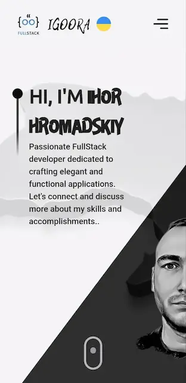
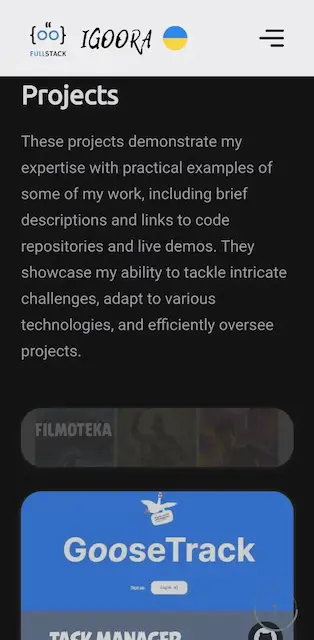

# My Full Stack Developer Portfolio

Welcome to my Full Stack developer portfolio! This repository contains a website showcasing my projects and information about me as a professional developer.The site has a responsive design and the ability to choose the interface language has been implemented.

## Built With

- React.js
- Framer Motion
- TailwindCSS
- Styled Components
- i18next

## Live Demo

- Click [here](http://igoora.pp.ua/) to visit my portfolio site.

## About Me

Allow me to introduce myself. I'm a Full Stack developer with experience in both frontend and backend development. My goal is to create robust and innovative web applications.

## Overview

In this portfolio, I demonstrate my skills and the projects I've created. Explore my projects and learn more about my development capabilities.

### Technologies

In this section, you'll find information about the technologies and tools I use in my projects.

## Project Overview

In this section, you'll find information about my projects. I've detailed each project with descriptions, links to their GitHub repositories, and live demos for your reference.

### Experience

I gained valuable experience learning in the technology industry. In this section, a brief overview of my professional journals.

## How to Use This Repository

1. Clone the repository: `git clone https://github.com/IG00RA/portfolio.git`
2. Install dependencies: `npm install`
3. Start the local server: `npm run dev`

## Thanks for Viewing!

Thank you for visiting my portfolio. I'm always open to collaboration and discussing new projects. Feel free to reach out to me via email or social media.

**Email:** gromadskiyigor@gmail.com
**LinkedIn:** [Igoora](https://www.linkedin.com/in/igoora/)
**Telegram:** [Igoora](https://t.me/igoora)

© Igoora

## Show your support

Give a ⭐️ if you like this project!
