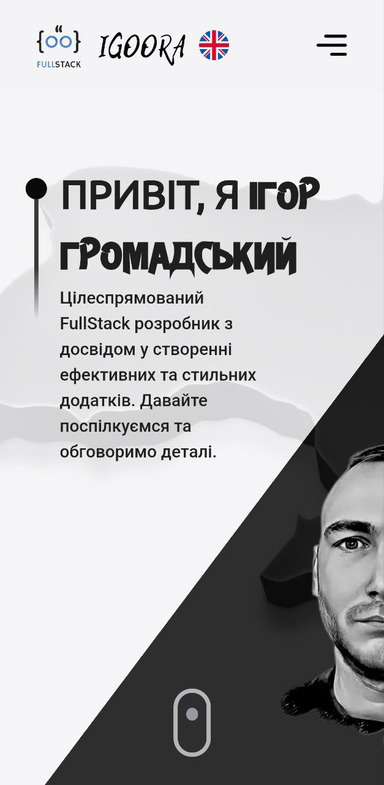
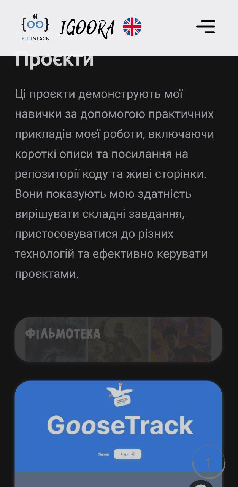

# Мій сайт-портфоліо Full Stack розробника

Ласкаво просимо до мого портфоліо Full Stack розробника! Цей репозиторій містить веб-сайт, на якому представлені мої проекти та інформація про мене як професійного розробника.

## Розроблено з використанням

- React.js
- Framer Motion
- TailwindCSS
- Styled Components

## Жива сторінка

- Клацніть [тут](http://igoora.pp.ua/), щоб перейти на мій сайт-портфоліо.

## Про мене

Дозвольте мені представитися. Я Full Stack розробник з досвідом у розробці як фронтенду, так і бекенду. Моя мета - створювати надійні та інноваційні веб-додатки.

## Огляд

У цьому портфоліо я демонструю свої навички та проекти, які я створив. Досліджуйте мої проекти та дізнавайтеся більше про мої можливості в розробці.

### Технології

У цьому розділі ви знайдете інформацію про технології та інструменти, які я використовую у своїх проектах.

## Огляд проектів

У цьому розділі ви знайдете інформацію про мої проекти. Міститься короткий опис, а також наведено посилання на їх репозиторії GitHub та посилання на живі сторінки.

### Досвід

Я набув важливий досвід навчаючись в GoIT. У цьому розділі надано короткий огляд моїх професійних досягнень.

## Як користуватися цим репозиторієм

1. Клонуйте репозиторій: `git clone https://github.com/IG00RA/portfolio.git`
2. Встановіть залежності: `npm install`
3. Запустіть локальний сервер: `npm run dev`

## Дякую за перегляд!

Дякую, що відвідуєте моє портфоліо. Я завжди відкритий для співпраці та обговорення нових проектів. Не соромтеся зв'язатися зі мною за допомогою електронної пошти або соціальних мереж.

**Електронна пошта:** gromadskiyigor@gmail.com
**LinkedIn:** [Igoora](https://www.linkedin.com/in/igoora/)
**Telegram:** [Igoora](https://t.me/igoora)

© Igoora

## Підтримайте цей проект

Поставте зірочку ⭐️, якщо вам сподобався цей проект!
